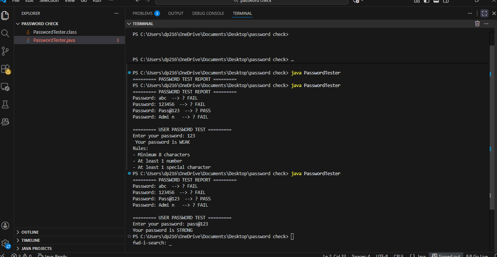

# 🔐 Password Strength Tester (Java)

## 1. Project Title & Goal
This program validates password strength by checking if passwords meet minimum security requirements (8+ characters, at least one number, and at least one special character), displaying PASS/FAIL results for predefined passwords and user input.

---

## 2. Setup Instructions

### Prerequisites
- Java JDK 8 or higher installed
- Command Prompt / Terminal / PowerShell

### Commands to Run

**Compile the program:**
```bash
javac PasswordTester.java
```

**Run the program:**
```bash
java PasswordTester
```

---

## 3. The Logic (How I Thought)

### Why This Approach?

I chose **regex pattern matching** for validation because it's:
- **Efficient**: Single pass through the password string for each check
- **Readable**: Clear patterns that match industry-standard password rules
- **Scalable**: Easy to add more complex patterns (e.g., uppercase letters, length limits)
- **Maintainable**: Rules are centralized in one validation function

The program uses a **modular design** with a separate `validatePassword()` method, making it easy to test and reuse.

### Hardest Bug & Solution

**Bug**: The initial validation logic only required a number OR special character, not BOTH.
```java
// ❌ WRONG (OR logic)
return hasNumber || hasSpecial;
```

**Fix**: Changed to AND logic to enforce both requirements:
```java
// ✅ CORRECT (AND logic)
return hasNumber && hasSpecial;
```

This ensures passwords like "Pass123" (no special char) or "Pass@@@" (no numbers) are correctly rejected as WEAK.

---

## 4. Output Screenshots

### Sample Run Output
```
========= PASSWORD TEST REPORT =========
Password: abc  --> ❌ FAIL
Password: 123456  --> ❌ FAIL
Password: Pass@123  --> ✅ PASS
Password: Admi n   --> ❌ FAIL

========= USER PASSWORD TEST =========
Enter your password: MyPassword@2026
Your password is STRONG
```

### Test Case Examples
| Password | Length | Has Number | Has Special | Result |
|----------|--------|----------- |------------ |--------|
| abc      | 3      | ❌         | ❌         | FAIL   |
| 123456   | 6      | ✅         | ❌         | FAIL   |
| Pass@123 | 8      | ✅         | ✅         | PASS   |
| Admi n   | 6      | ❌         | ❌         | FAIL   |
| MyPass@2 | 8      | ✅         | ✅         | PASS   |

---

## 5. Future Improvements (If I Had 2 More Days)

### Enhancement Ideas:

1. **Uppercase & Lowercase Checks**
   - Add regex patterns for uppercase/lowercase requirements
   - Strengthen security by encouraging mixed-case passwords

2. **Password Strength Score**
   - Display a visual strength meter (Weak/Fair/Good/Strong)
   - Show percentage-based confidence score

3. **Common Password Detection**
   - Load a list of common weak passwords ("password123", "admin", etc.)
   - Reject passwords that match known compromised lists

4. **GUI Interface**
   - Replace console with JavaFX or Swing GUI
   - Real-time validation feedback as user types
   - Visual password strength indicator bar

5. **Password Generation Tool**
   - Auto-generate strong passwords based on rules
   - Export multiple suggestions for user selection

6. **Logging & Statistics**
   - Track how many passwords passed/failed
   - Save test history to a file for analysis

---

**Author**: Password Strength Validator  
**Last Updated**: January 2026


.
